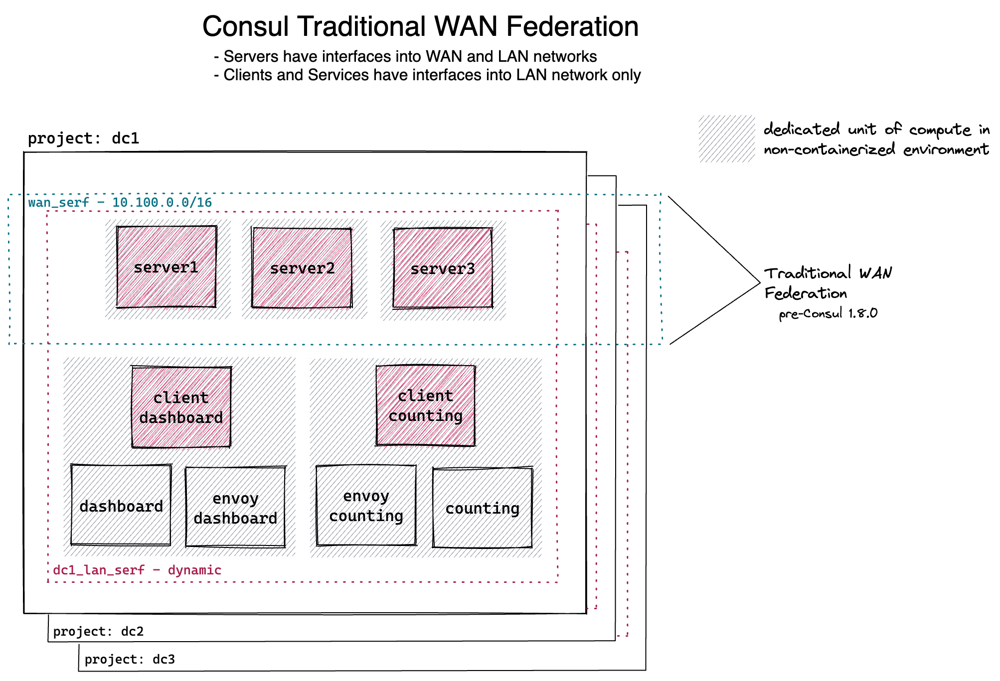

# Consul Compose Datacenters
This repo contains a docker compose file that can be leveraged to create distinct datacenters by project name, defaulting to `dc1`.

There is no concept of a node in this environment (well, really, it's one), but the deployment virtually models what would *"normally"* be associated with a VM-based environment.




# Workflow
- Update `.env` *[and prepare license secret, if using enterprise]*
- Create the agent private certificate authority `cd secrets/ && consul tls ca create`
  *NOTE* we're not enforcing any form of TLS just yet...
- Create `dc1` 
  ```sh
  docker compose [-p dc1] up [compose-service-group] -d

  # UPDATE: set to three server instances in compose.yaml
  # optionally scale services
  #docker compose up --scale consul-server=3 -d

  # UPDATE: used compose dns to automatically join
  # manually join the cluster because I haven't found a good way 
  # to leverage scaling and unique hostnames for a service
  #CMD="consul join $(docker network inspect dc1_lan_serf | \
  #  jq -r ' [ .[].Containers[]
  #    | select(.Name | contains("consul-server-1")| not )
  #    | .IPv4Address ] | join(" ")' \
  #)"
  #docker exec dc1-consul-server-1 ${CMD//\/16/} && ( sleep 5 ; docker exec dc1-consul-server-1 consul operator raft list-peers )
  ```

- Create `dcX` where `X < 4`
  ```sh
  CONSUL_DATACENTER="dcX"
  docker compose -p ${CONSUL_DATACENTER} up -d

  # UPDATE: no longer necessary
  #CMD="consul join $(docker network inspect "${CONSUL_DATACENTER}_lan_serf" | \
  #  jq -r ' [ .[].Containers[]
  #    | select(.Name | contains("consul-server-1")| not )
  #    | .IPv4Address ] | join(" ")' \
  #)"
  #docker exec "${CONSUL_DATACENTER}-consul-server-1" ${CMD//\/16/} && ( sleep 5 ; docker exec "${CONSUL_DATACENTER}-consul-server-1" consul operator raft list-peers )
  ```

# References
- https://docs.docker.com/compose/compose-file/
- https://docs.docker.com/engine/reference/commandline/network_create


# Credits
- https://github.com/Ranjandas/learn-consul-connect


# Scratchpad
Traditional Federation
*with no direct service-to-service routing between datacenters (IE: service catalog only inter-dc)*
- [x] Inter-DC Service Look-up
  ```sh
  docker exec dc1-consul-server-1 \
    nslookup -port=8600 dashboard.service.dc<X>.consul 127.0.0.1
  ```
- [x] Distinct/Independent Services per DC
- [ ] ...

WAN Federation
*with no direct service-to-service routing, a mesh gateway enables a routable path*
- [x] Cross-DC Discovery Chain-based failover capabilities
- [ ] ...

Packet Sniffing
- Counting: `tcpdump -i eth0 -s0 -nA 'not port (8301 or 8300) and not arp'`
- Dashboard:
   - No Connect: `curl -s counting.service.consul:9001 # payload visible in clear text`
   - Connect:  `curl -s localhost:9001 # payload encrypted`